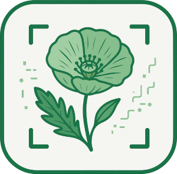
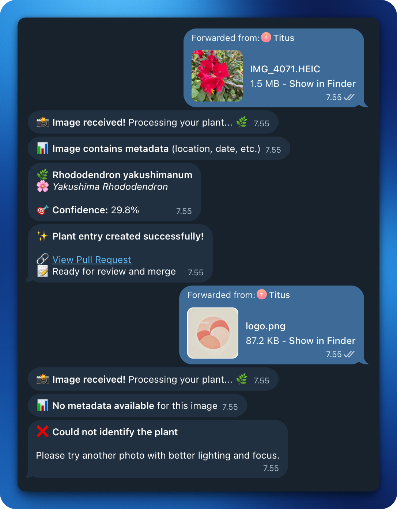

<div align="center">
    <br />
    <h1 align="center">Herbarium Bot</h1>
    <sub><em>A timeless notebook of leaves and memories, lovingly pressed by curious hands.</em></sub>
</div>


<div align="center">
  <sub>Created by <a href="https://github.com/jgengo">Jordane Gengo</a></sub>
</div>

<br /><br />

🌿 **Automated Plant Documentation Bot**

A Telegram bot that automatically processes plant photos, extracts metadata, identifies species, and updates my portfolio's herbarium collection.

<div align="center">
 <br />
</div><br />

> [!NOTE]
> This bot is designed to work with my personal portfolio repository.

<br>

## Features

* 📸 **Image Processing** - Receives and processes plant photos via Telegram
* 📍 **Location Extraction** - Extracts GPS coordinates and location data from EXIF metadata
* 📅 **Date Detection** - Automatically captures when the photo was taken
* 🌱 **Plant Identification** - Integrates with Pl@ntNet for species identification
* 📝 **Template Generation** - Fills markdown templates with plant information
* 🔄 **Portfolio Integration** - Creates pull requests to update my herbarium collection
* 🤖 **Automated Workflow** - Streamlines the entire process from photo to documentation

## Tech Stack

* **Language:** Python 3.12+
* **Telegram API:** python-telegram-bot
* **Image Processing:** Pillow (PIL) + pillow-heif
* **EXIF Extraction:** piexif
* **Plant Identification:** Pl@ntNet API
* **Git Operations:** Git subprocess commands (no GitPython)
* **Markdown Processing:** Jinja2 templates
* **Package Management:** uv

## Getting Started

### Prerequisites

* Python 3.12 or higher
* Telegram Bot Token (from [@BotFather](https://t.me/botfather))
* Pl@ntNet API key
* GitHub Personal Access Token (for portfolio integration)

### Installation

1. **Clone the repository:**
   ```bash
   git clone https://github.com/jgengo/portfolio-herbarium-bot.git
   cd portfolio-herbarium-bot
   ```

2. **Install dependencies:**
   ```bash
   uv sync
   ```

3. **Set up environment variables:**
   Create a `.env` file and configure your environment variables:
   ```bash
   # Telegram Bot Configuration
   TELEGRAM_BOT_TOKEN="YOUR TELEGRAM BOT TOKEN"

   # Pl@ntNet API Configuration
   PLANTNET_API_KEY="YOUR PLANTNET API KEY"
   PLANTNET_API_URL="https://my-api.plantnet.org/v2/identify/all"

   # GitHub Configuration
   GITHUB_TOKEN="YOUR GITHUB TOKEN"
   GITHUB_REPO_URL="YOUR GITHUB REPO URL"
   GITHUB_REPO_OWNER="YOUR GITHUB NAME"
   GITHUB_REPO_NAME="YOUR GITHUB REPO NAME"

   # Optional: Comma-separated list of allowed Telegram user IDs
   ALLOWED_USER_IDS=""

   # Logging Configuration
   # Options: DEBUG, INFO, WARNING, ERROR, CRITICAL
   # Use DEBUG for local development, WARNING/ERROR for production
   LOGGING_LEVEL="WARNING"
   ```

4. **Run the bot:**
   ```bash
   uv run python -m herbabot.main
   ```

## Usage

1. **Send a photo** of a plant to the Telegram bot (as file!)
2. **Wait for processing** - The bot will:
   - Extract location and date from EXIF data
   - Identify the plant species
   - Generate a markdown entry
   - Create a pull request to my portfolio
3. **Review and merge** the pull request to add the plant to my herbarium

## Project Structure

```
portfolio-herbarium-bot/
├── herbabot/                    # Core bot code
│   ├── __init__.py             # Package initialization
│   ├── config.py               # Environment & config loader
│   ├── exif_utils.py           # EXIF metadata extraction utilities
│   ├── github_pr.py            # GitHub pull request creation
│   ├── handlers.py             # Telegram bot message handlers
│   ├── handlers_utils.py       # Handler utility functions
│   ├── main.py                 # Bot entry point
│   ├── plant_entry.py          # Plant entry data models
│   └── plant_id.py             # Pl@ntNet identification service
├── templates/                   # Markdown templates
│   ├── bot_welcome.md          # Welcome message template
│   └── plant_entry.md.j2       # Plant entry template (Jinja2)
├── .github/                    # GitHub configuration
│   ├── docs/                   # Documentation assets
│   │   └── logo.png            # Project logo
│   └── PULL_REQUEST_TEMPLATE.md # PR template
├── media/                      # Media files directory
├── Dockerfile                  # Docker configuration
├── .dockerignore              # Docker ignore rules
├── .gitignore                 # Git ignore rules
├── .python-version            # Python version specification
├── LICENSE                    # MIT License
├── pyproject.toml             # Project configuration & dependencies
├── renovate.json              # Renovate bot configuration
├── uv.lock                    # uv lock file
└── README.md                  # <-- YOU ARE HERE!
```

## Configuration

### Logging Configuration

The bot supports different logging levels for different environments:

- **Local Development:** Set `LOGGING_LEVEL="DEBUG"` for detailed logs
- **Production:** Set `LOGGING_LEVEL="WARNING"` or `LOGGING_LEVEL="ERROR"` for minimal logs

Available levels: `DEBUG`, `INFO`, `WARNING`, `ERROR`, `CRITICAL`

Example for local development:
```bash
LOGGING_LEVEL="DEBUG"
```

Example for production:
```bash
LOGGING_LEVEL="WARNING"
```

### GitHub Integration

To use the bot's GitHub integration features, you need to create a fine-grained personal access token with specific permissions:

1. **Go to GitHub Settings:**
   - Navigate to [GitHub Settings > Developer settings > Personal access tokens > Fine-grained tokens](https://github.com/settings/tokens?type=beta)
   - Click "Generate new token (classic)"

2. **Configure Token Settings:**
   - **Token name:** `herbarium-bot` (or any descriptive name)
   - **Expiration:** Choose an appropriate expiration date
   - **Repository access:** Select "Only select repositories" and choose your portfolio repository

3. **Set Required Permissions:**
   - **Repository permissions:**
     - **Metadata:** `Read access` (required for repository information)
     - **Contents:** `Read and write` (required for creating branches and commits)
     - **Pull requests:** `Read and write` (required for creating pull requests)

4. **Generate and Save Token:**
   - Click &quot;Generate token&quot;
   - Copy the token immediately (it won't be shown again)
   - Add it to your `.env` file as `GITHUB_TOKEN`

The bot will then automatically:
- Create feature branches for new plant entries
- Generate descriptive commit messages
- Opens pull requests with plant information

## FAQ

**Why do I need to send photos as files instead of regular photos?**

Telegram strips EXIF data (GPS, date) from regular photos. The bot needs this metadata to automatically extract location and date information. File uploads preserve the original image quality and metadata.

**How to send as file:** 

Tap 📎 → Select "File" → Choose photo → Send

**How accurate is the identification?** 

Accuracy depends on image quality and plant rarity. Best results come from:
- Clear, well-lit photos
- Close-ups of flowers/leaves
- Single plant species in frame

**Can I use this for my own portfolio?**

Yes! Fork the repo, update the GitHub settings in your environment variables, and customize the templates to match your style.


## Contributing

See [CONTRIBUTING.md](CONTRIBUTING.md) for guidelines on setting up your
development environment and opening pull requests.

## License

This project is licensed under the MIT License - see the [LICENSE](LICENSE) file for details.

## About

Created by [Jordane Gengo](https://github.com/jgengo)

Because documenting nature should be as effortless as taking a photo.


